<!-- Banner del proyecto. Generar con el prompt en docs/BANNER_PROMPT.md
     y guardar como docs/images/banner.png (1920x1080, 16:9). -->
<p align="center">
  
</p>

# Tropico 🌴

**La red económica del venezolano en Solana.**

> No es una wallet más — es una red de pagos non-custodial paralela al sistema bancario, donde el dinero gira en USDC entre consumidores y comercios afiliados, sin tocar el bolívar ni los bancos.

[](https://solana.com)
[](#license)
[](https://dev3pack.com)
[](#)

---

## 🎬 Demo

- 🌐 **Live demo**: [tropico.vercel.app](https://tropico.vercel.app) *(actualizá con tu URL real después de deploy)*
- 🎥 **Video pitch (4-5 min)**: [YouTube](https://youtube.com) *(actualizá con link unlisted)*
- 📊 **Pitch deck**: [`docs/PITCH_DECK.md`](docs/PITCH_DECK.md)
- 📖 **Brief técnico completo**: [`docs/TROPICO_BRIEF.md`](docs/TROPICO_BRIEF.md)

### El momento red económica (lo que hay que ver)

Abrí dos ventanas:
1. `/cobrar` como merchant → ingresá $5 → "Generar QR"
2. Otra ventana como cliente → escaneá el QR → "Simular pago recibido"
3. Ves: cliente paga $5, merchant recibe **$4.95 en <1s**, Tropico cobra **$0.05** (1%), cliente recibe **$0.05 cashback**.

**Esto es lo que ningún POS hace en 1 segundo.**

---

## 💡 El problema

En Venezuela:

- **95% del volumen cripto** vive atrapado en USDT/Tron por Binance P2P
- Las apps en español (Reserve, Kontigo, Zinli) son **custodias** y solo guardan dólares
- Phantom es non-custodial pero **asume usuario experto** — expulsa al 95% del mercado
- Los comercios pagan **4.5%** en POS Banesco + esperan **24-72h** para ver la plata
- El bolívar **se devalúa entre la venta y el cierre del día**

**No existe una plataforma multi-feature, non-custodial, en español venezolano, sobre Solana.**

---

## ⚡ La solución

Dos productos integrados bajo una marca paraguas, **Red Tropico**:

### 🌴 Tropico Wallet (consumidor)

- Login con email vía **Privy** (embedded MPC wallet, sin instalar Phantom)
- Saldo USDC con **yield ~5% APY default ON** (mSOL/Kamino bajo el hood)
- Swap aggregator vía **Jupiter v6** con `platformFeeBps=50` (0.5% fee a Tropico)
- Envíos peer-to-peer con **Solana Pay** + claim links por WhatsApp
- **Carlos AI**, copiloto venezolano powered by **Lumen**

### 💳 Tropico Comercios (merchant)

- QR Solana Pay para cobros instantáneos en USDC
- Settlement **<1 segundo** (vs 24-72h del POS Banesco)
- Fee al merchant **1%** (vs 4.5% Banesco — ahorro 60-75%)
- Sin chargebacks, sin contrato, sin POS hardware
- Logo "Acepta Tropico" descargable para vidriera del local

### El efecto red económica

Cuando ambos lados están dentro de Tropico, el dinero gira en USDC sin pasar por bancos. El comercio puede ofrecer cashback al cliente porque ahorra ~$35/mes por cada $1k en ventas vs Banesco. Es **MercadoPago para Solana, nativo de USDC, non-custodial**.

---

## 💰 Modelo de negocio

5 streams de revenue desde el día 1:

| Stream | Tasa | Mecánica |
|---|---|---|
| **Swap** | 0.5% | Jupiter `platformFeeBps` al ATA propio |
| **Send** | 0.3% | Spread USDC en envíos |
| **Yield (Save)** | 2% del yield | Performance fee sobre mSOL/Kamino |
| **Merchant fee** | 1% | Por cada cobro recibido |
| **Carlos AI** | acelerador | Multiplica retention 2-3× |

**Proyección Year 1**: 50K usuarios + 2K comercios = **$250K MRR mes 12** sobre **$44M de volumen mensual**.

---

## 🏗️ Stack técnico

### Frontend
- **Framework**: Next.js 15 (App Router) + React 19 + Tailwind 3
- **Tipografía**:
  - **Honk** (Google Fonts variable, 2024) — wordmark "Tropico" expresivo
  - **Bricolage Grotesque** — titulares de sección
  - **Manrope** — body/UI (alternativa moderna a Inter)
- **Animaciones**: CSS keyframes + variable fonts axes (sin librerías pesadas)
- **Splash screen**: pixel-art reveal animation con sol saliendo (~3s, skip-able)
- **Iconos**: [Lucide React](https://lucide.dev) — open-source, 1500+ iconos, tree-shakeable (~5KB por icono usado). Para acciones funcionales (swap, send, qr, etc.). Emojis culturales (🌴, 🇻🇪) preservados como signature.

### Wallet & blockchain
- **Wallet primario**: [Privy](https://privy.io) embedded MPC (login con email)
- **Wallet fallback**: Solana Wallet Adapter (Phantom + Solflare)
- **Swap**: [Jupiter v6](https://lite-api.jup.ag) con `platformFeeBps=50`
- **Pay**: [Solana Pay spec](https://docs.solanapay.com) + QR client-side via `qrcode`
- **RPC**: [Helius](https://helius.dev) (free tier 100K req/mes)

### Capa agéntica
- **AI agent framework**: [Lumen](https://github.com/gabogabucho/lumen-agent) + DeepSeek-V4 default (LiteLLM-agnostic)
- **Firma autónoma** (Modo Agente): OpenClaw + Privy delegated session keys

### Datos en vivo
- **Tasa USD/VES**: [ve.dolarapi.com](https://ve.dolarapi.com) (paralelo + BCV oficial)
- **Precios tokens USD**: Jupiter Price API v3
- **State**: TanStack Query 5

### Hosting & infra
- **Hosting**: Vercel (free tier)
- **Cero programa Anchor custom** — usamos protocolos abiertos de Solana
- **Cero backend persistente** — solo `/api/*` Edge routes

---

## 📸 Screenshots

### Landing (con header sticky + nav + CTA wallet)
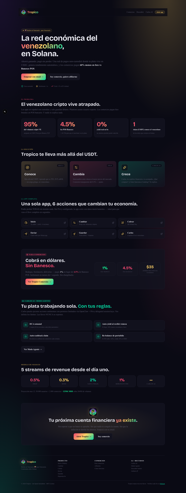

### Home — dashboard del usuario
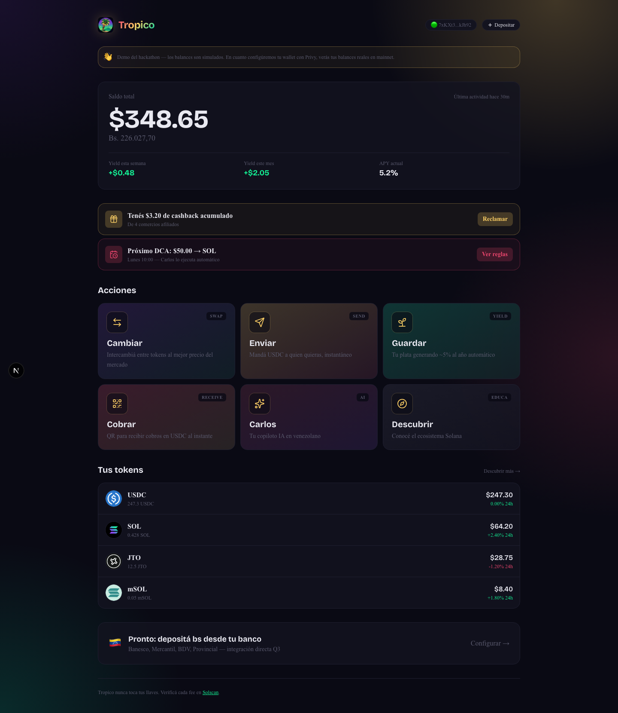

### Cambiar — swap real con Jupiter Quote API
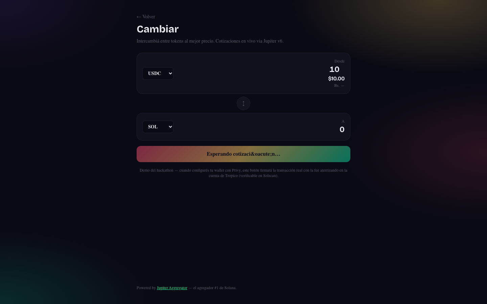

### Cobrar — QR Solana Pay generado real
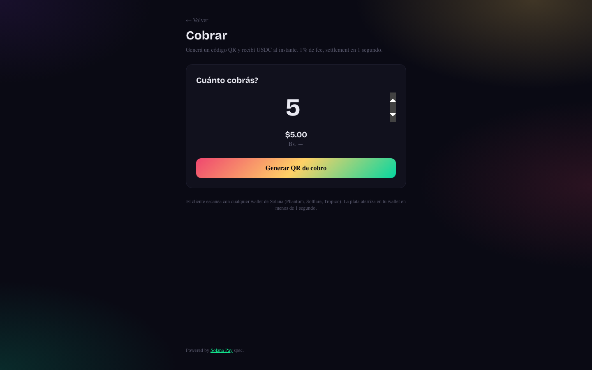

### Carlos AI — Modo Agente con 4 acciones autónomas
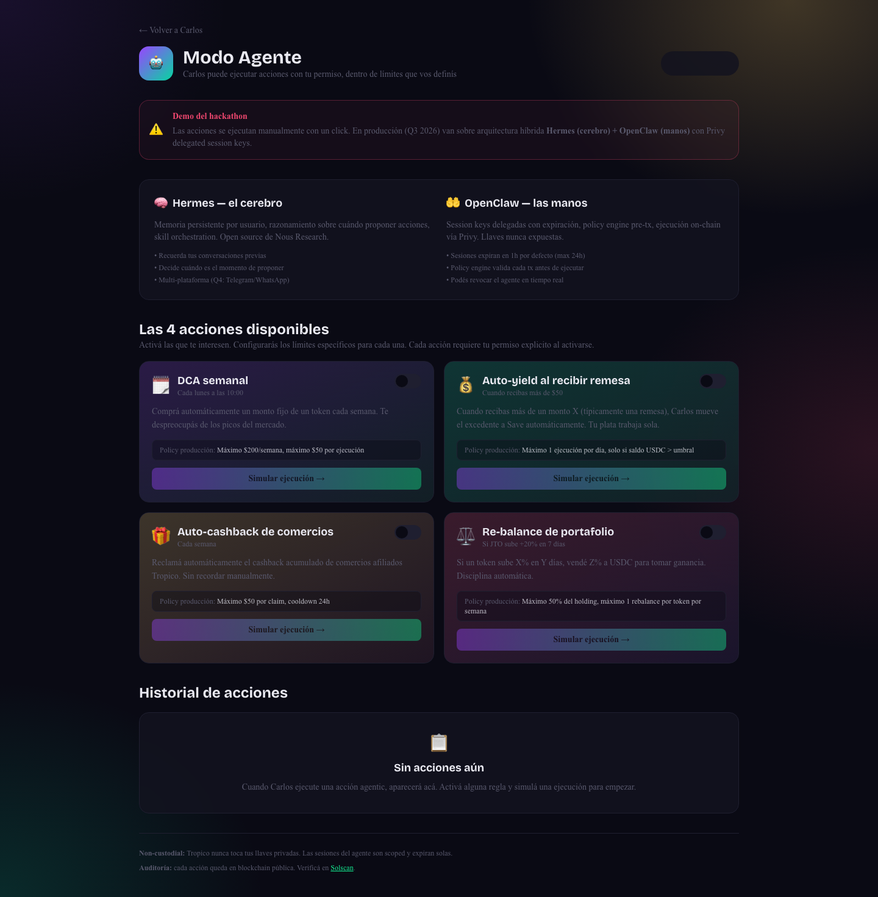

### Tropico Comercios — landing merchant con comparativa Banesco
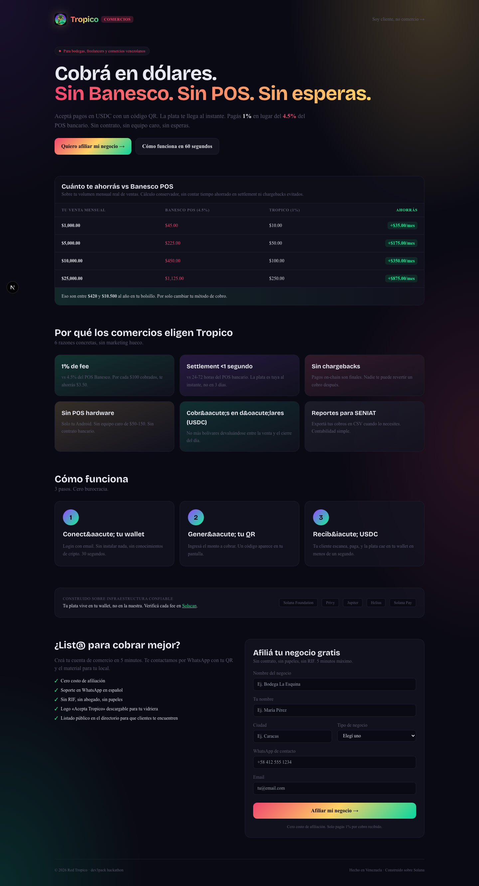

### Descubrir — 8 tokens curados con copy venezolano
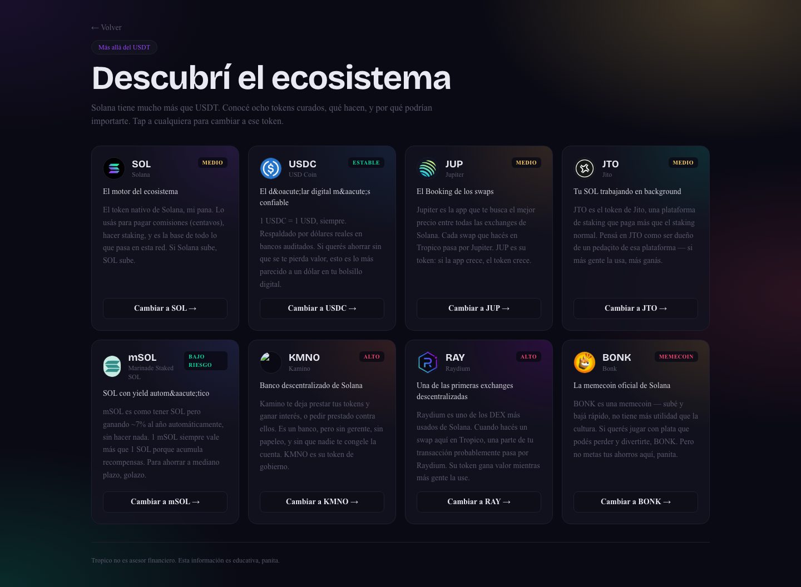

<details>
<summary>Más screenshots — Enviar, Guardar, Depositar, Carlos chat</summary>

| Pantalla | Desktop | Mobile |
|---|---|---|
| Enviar (claim link + WhatsApp) | 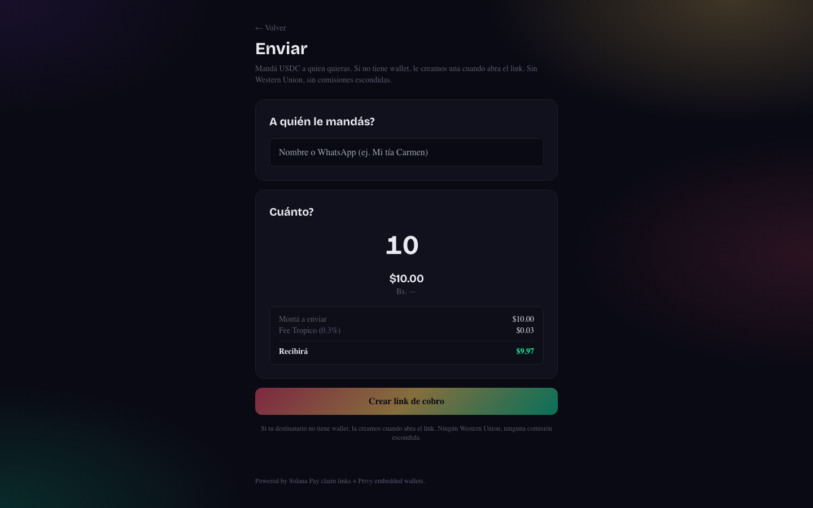 | 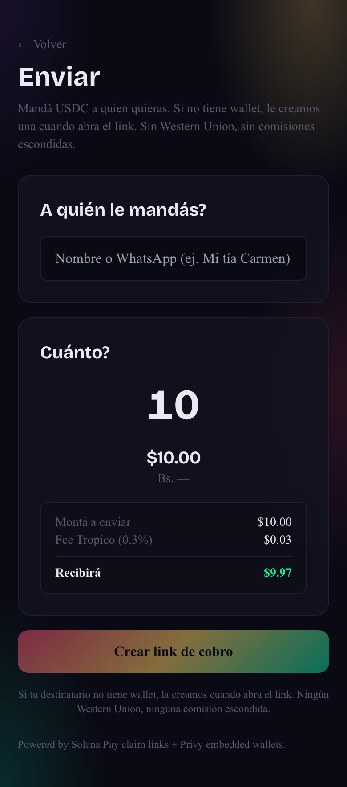 |
| Guardar (yield UI) | 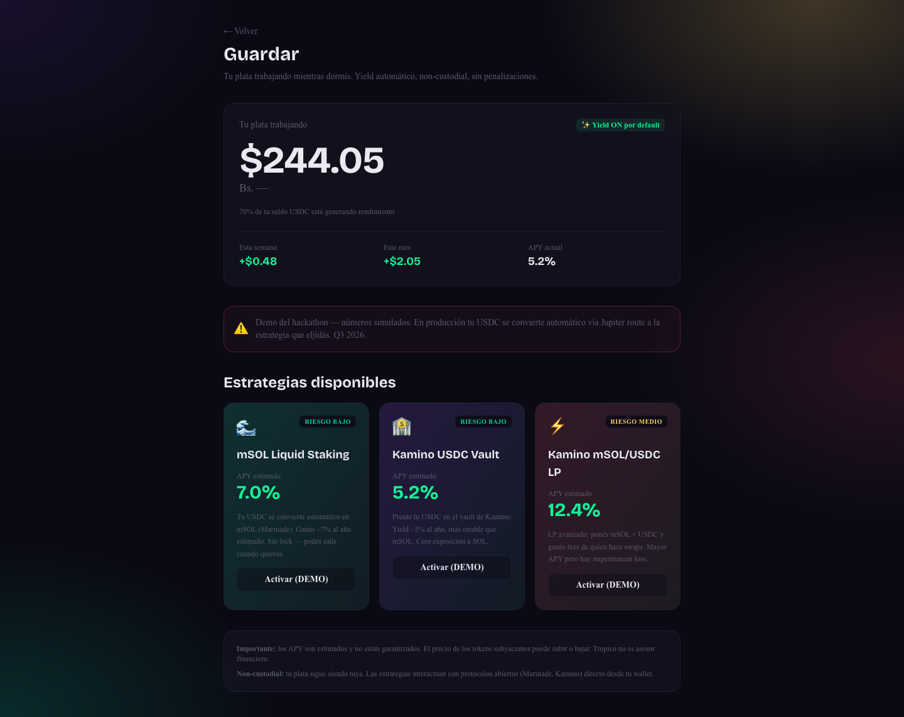 | 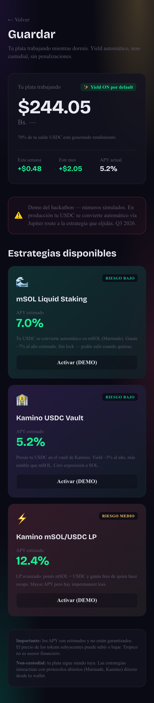 |
| Depositar (onramp stub + faucet) | 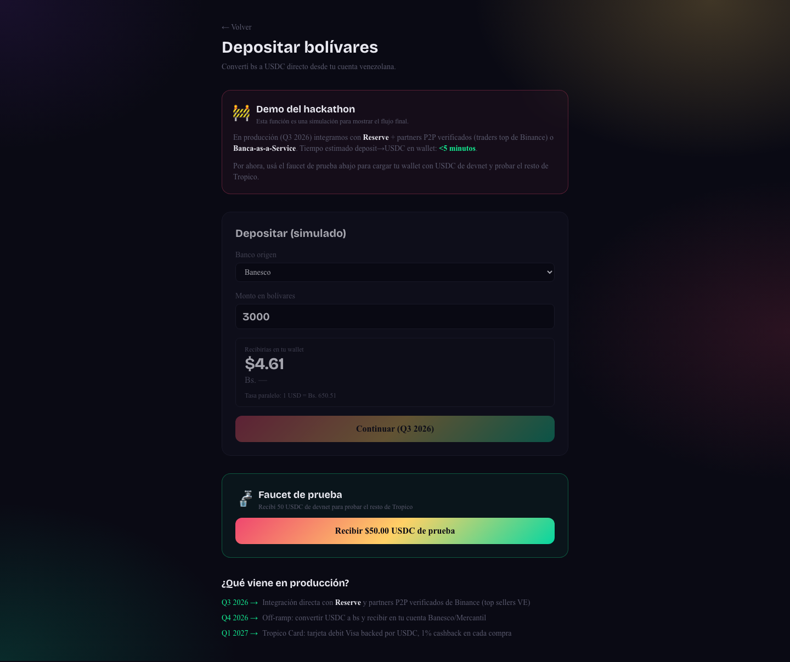 | — |
| Carlos chat | 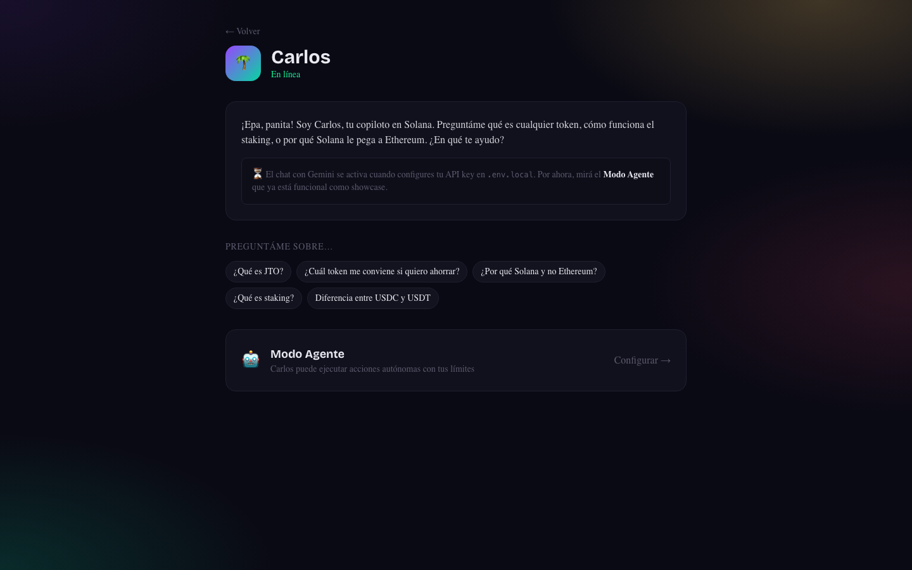 | — |

</details>

> 📝 Para regenerar todos los screenshots: `node scripts/screenshots.mjs` (requiere `npm install -D playwright` + `npx playwright install chromium`).

---

## 🚀 Ejecutar localmente

### Requisitos

- Node.js 20+ (probado en 22.x)
- npm 10+
- Python 3.11+ (solo si vas a correr capabilities Lumen)

### Setup

```bash
# 1. Clonar repo
git clone https://github.com/[tu-usuario]/Hackathon.git tropico
cd tropico

# 2. Instalar deps
npm install

# 3. (Opcional) Configurar .env.local con API keys reales
# Mirá .env.example o docs/REGISTRO_PROYECTO.md
cp .env.example .env.local 2>/dev/null || true
# Editar .env.local con NEXT_PUBLIC_PRIVY_APP_ID, GOOGLE_GENERATIVE_AI_API_KEY, etc.
# (Sin keys, la app corre 100% con mocks honestos.)

# 4. Arrancar dev server
npm run dev
# → http://localhost:3000
```

### 11 rutas para explorar

| URL | Qué muestra |
|---|---|
| `/` | Landing pública con hero + 3 cards módulos |
| `/home` | Dashboard del usuario (saldo + yield + 6 ModuleCards + balances) |
| `/descubrir` | Catálogo educativo de 8 tokens en venezolano |
| `/cambiar` | Swap UI con cotización **Jupiter Quote API REAL** |
| `/cobrar` | QR Solana Pay generado real + listener simulado |
| `/enviar` | Form send + claim link + WhatsApp deep link funcional |
| `/guardar` | Yield UI con 3 estrategias (mSOL, Kamino USDC, Kamino LP) |
| `/depositar` | Onramp stub honesto + faucet button |
| `/comercios` | Landing del lado merchant con comparativa vs Banesco POS |
| `/carlos` | UI shell del chat AI |
| `/carlos/agente` | Modo Agente con 4 acciones autónomas (DCA, auto-yield, auto-cashback, re-balance) |

---

## 🤖 Capa agéntica — Carlos AI

Carlos corre sobre **Lumen** (open-source agent framework, MIT license).

```
┌─── CARLOS AI (Lumen) ───┐
│  personality.yaml       │
│  + 7 skills             │
│  + capabilities Python  │
│  + LLM (DeepSeek/Gemini)│
└─────────────────────────┘
              │
              ▼ (solo Modo Agente)
┌─── OpenClaw + Privy ───┐
│  policy engine          │
│  delegated session keys │
│  firma on-chain         │
└─────────────────────────┘
```

**Lumen Kit incluido en este repo** ([`lumen-kit/`](lumen-kit/)):
- `kit/personality.yaml` — Carlos venezolano completo
- `skills/` — 7 skills (prices, balances, swap, pay, yield, cashback, agent-actions)
- `capabilities/` — 3 scripts Python funcionales (precio_bs, precio_usd, jupiter_quote)

Para integración real ver [`docs/LUMEN_INTEGRATION.md`](docs/LUMEN_INTEGRATION.md).

---

## 🔐 Principios no negociables

1. **Cero programa Anchor custom** — usamos protocolos abiertos (SPL Token, Jupiter, Solana Pay)
2. **Cero backend persistente / cero base de datos** — solo `/api/*` Edge routes
3. **Non-custodial estricto** — Tropico NUNCA accede a llaves privadas
4. **API keys secretas SOLO server-side** — nunca en client
5. **Mobile-first PWA** — funciona en Android viejo, instalable sin Play Store
6. **Solana-Maxi branding** — cero menciones positivas a EVM/Tron/Bitcoin
7. **Cero política venezolana** en Carlos AI
8. **Cero promesas de rendimientos garantizados**

---

## 🗺️ Roadmap

| Trimestre | Hitos |
|---|---|
| **Hoy (MVP)** | 11 rutas live, mocks honestos, Lumen kit estructurado, 3 capabilities funcionales |
| **Q3 2026** | Privy + Helius + Lumen real conectados, OpenClaw integration, on-ramp con partners P2P/Reserve |
| **Q4 2026** | **Tropico Card** (debit Visa backed por USDC + cashback), Tropico Vaults (Kamino), Tropico Earn |
| **Q1 2027** | LATAM expansion (Colombia, Argentina, México, Perú, Chile), Solana Mobile app nativa |

Ver roadmap completo en [`docs/ROADMAP.md`](docs/ROADMAP.md).

---

## 🎨 Identidad visual

**Paleta caribeña venezolana dominante** (Solana como acento sutil, no como base):

| Color | Hex | Uso |
|---|---|---|
| Sun (caribbean yellow) | `#FFD166` | Sol, acentos cálidos, badges venezolanos |
| Coral (hot pink) | `#EF476F` | Acción, atardecer, plumaje guacamaya |
| Sea (tropical green) | `#06D6A0` | Mar, frondas palmera, confirmaciones |
| Sand beige | `#d4b896` | Playa, fondos cálidos |
| Solana Purple | `#9945FF` | Acento tech (NO dominante) |
| Solana Green | `#14F195` | Acento tech (NO dominante) |
| Ink (background) | `#0a0a14` | Fondo base con gradient warm overlay |

El **gradient firma** es el atardecer caribeño: `coral → sun → sea`. Aparece en:
- Wordmark "Tropico" (Honk font con clip-path gradient)
- Botones primarios
- Hero del landing
- Splash screen logo reveal

## 🔐 Cómo funciona la wallet — Privy MPC embedded

Tropico **NO usa el modelo tradicional de seed phrase**. Usa **Privy embedded wallet** con **MPC (Multi-Party Computation)**, radicalmente más simple para el venezolano común y más seguro contra pérdidas.

### Flujo de creación (15 segundos, sin seed phrase)

```
1. Usuario clickea "Empezar con email"
2. Ingresa su email
3. Recibe OTP (código 6 dígitos) por mail
4. Privy ejecuta MPC handshake EN EL BROWSER:
     - Genera 3 "shares" criptográficos
     - share-1 → dispositivo del usuario (encriptado)
     - share-2 → infraestructura Privy (encriptada)
     - share-3 → guardian backup (encriptado)
5. La llave privada COMPLETA NUNCA EXISTE
6. Para firmar tx, los 3 shares cooperan SIN reconstruir la llave
7. ✅ Wallet Solana lista, pubkey visible en /home
```

### Lo que el usuario NO necesita

- ❌ Escribir seed phrase de 12-24 palabras
- ❌ Instalar extensión de browser (Phantom/Solflare)
- ❌ Bajar app móvil
- ❌ Recordar palabras

### Lo que SÍ tiene

| Feature | Detalle |
|---|---|
| **Login con email + OTP** | Default flow, 15 segundos |
| **PassKey biométrica opcional** | TouchID/FaceID/Windows Hello — reemplaza OTP |
| **Recuperación cross-device** | Login con mismo email en nuevo dispositivo → Privy reconstruye share |
| **Export de seed phrase opcional** | Para "graduarse" a Phantom: 12 palabras exportables desde config |

### ¿Es non-custodial de verdad?

**Sí, técnicamente.** Privy NUNCA tiene la llave completa. Aunque Privy se volviera malicioso, no podría firmar tx sin los otros 2 shares (dispositivo + guardian). Los 3 deben cooperar siempre.

### Modo demo (sin Privy App ID configurado)

Si deployás sin `NEXT_PUBLIC_PRIVY_APP_ID`, la app corre en **demo mode**:
- Pubkey mock visible en /home (`7xKXt3...kJh92`)
- Balances simulados realistas
- Botones de firma muestran "DEMO" — no firman tx real
- Banner explícito en /home indicando que es simulación
- **Todos los flows visuales completos** funcionan para presentar el producto

Para activar wallets reales: agregá `NEXT_PUBLIC_PRIVY_APP_ID` (de [dashboard.privy.io](https://dashboard.privy.io)) en `.env.local` o Vercel env vars y reiniciá.

---

## 🌅 Splash screen — animación al cargar

El primer load de la sesión muestra una animación pixel-art de bienvenida (~3 segundos, skip-able con tap):

1. **Fase 1 (0-800ms)**: Sol amarillo emerge por detrás escalando con rotación de rays
2. **Fase 2 (400-2200ms)**: Logo Tropico se arma pixel por pixel (256 cuadritos con stagger random) — frondas verde, tronco amber, cocos amarillos, guacamaya coral
3. **Fase 3 (2200-3000ms)**: Wordmark "TROPICO" en Honk fade-in con gradient atardecer + tagline
4. **Fase 4 (exit)**: Fade out → revela la landing

Implementación: `components/SplashScreen.tsx`. Solo se muestra una vez por sesión (sessionStorage flag).

## 📂 Estructura del repo

```
.
├── app/                          # Next.js App Router (11 páginas + 2 API routes)
├── components/                   # React components (DualPrice, SwapForm, ReceiveQR, etc.)
├── lib/                          # Helpers (jupiter, solana-pay, formato, mock-data, etc.)
├── public/                       # Static (manifest.json, icons)
├── lumen-kit/                    # Lumen agent kit
│   ├── kit/                      # Carlos personality
│   └── skills/                   # 7 skills SKILL.md + module.yaml
├── lumen-capabilities/           # Python scripts ejecutables
│   ├── prices/                   # precio_bs.py, precio_usd.py ✅
│   └── swap/                     # jupiter_quote.py ✅
├── docs/
│   ├── TROPICO_BRIEF.md          # Brief técnico completo (fuente de verdad)
│   ├── ROADMAP.md                # Visión Q3 → Q1 2027
│   ├── PITCH_DECK.md             # Pitch 6 slides Marp
│   ├── DEMO_READINESS.md         # Estado del demo + script 5min
│   ├── LUMEN_INTEGRATION.md      # Doc maestro de Lumen
│   ├── LOGO_PROMPT.md            # Prompt para generar logo pixel art
│   ├── GUION_ENTREVISTA.md       # Guión hablado para entrevistas
│   ├── REGISTRO_PROYECTO.md      # Datos para form del hackathon
│   └── DEPLOY.md                 # Guía de deploy a Vercel
└── .claude/skills/tropico-*/     # 6 Claude Code skills para devs
```

---

## 🌍 Variables de entorno

Crear `.env.local` con (todas opcionales — sin ellas la app corre con mocks):

```bash
# Privy embedded wallet
NEXT_PUBLIC_PRIVY_APP_ID=

# Google Gemini (Carlos AI fallback)
GOOGLE_GENERATIVE_AI_API_KEY=

# Helius RPC
NEXT_PUBLIC_HELIUS_RPC=https://mainnet.helius-rpc.com/?api-key=YOUR_KEY
HELIUS_API_KEY=

# Tropico fee account (wallet de fees + ATAs)
NEXT_PUBLIC_TROPICO_FEE_OWNER=
NEXT_PUBLIC_TROPICO_FEE_ATA_USDC=
NEXT_PUBLIC_TROPICO_FEE_ATA_SOL=
NEXT_PUBLIC_TROPICO_FEE_ATA_USDT=

# Cluster
NEXT_PUBLIC_SOLANA_CLUSTER=mainnet-beta
```

Detalles paso-a-paso en [`docs/REGISTRO_PROYECTO.md`](docs/REGISTRO_PROYECTO.md).

---

## 🚢 Deploy a Vercel

Ver [`docs/DEPLOY.md`](docs/DEPLOY.md) para la guía completa. TL;DR:

```bash
npx vercel --prod
```

---

## 🤝 Cómo contribuir

Esta es la versión MVP del hackathon dev3pack. Post-hackathon abrimos:

- Issues en GitHub para bugs / features
- Programa de afiliación de comercios (10% del fee del primer mes para quien afilia)
- Integración con más estrategias de yield (Jito Restaking, Sanctum)
- Bug bounty público (Q3 2026)

---

## 📜 License

MIT — ver [`LICENSE`](LICENSE).

---

## 👤 Autor

Construido por un venezolano para venezolanos.

- **Email**: rafa.oviedo2000@gmail.com
- **Hackathon**: [dev3pack 2026](https://dev3pack.com), Caracas hub
- **Twitter/X**: [@tu-handle]
- **GitHub**: [@tu-usuario]

---

## 🌴 La frase que importa

> **Tropico no es una wallet. Es la infraestructura económica que el venezolano necesita y que nadie le está dando — hasta hoy.**
