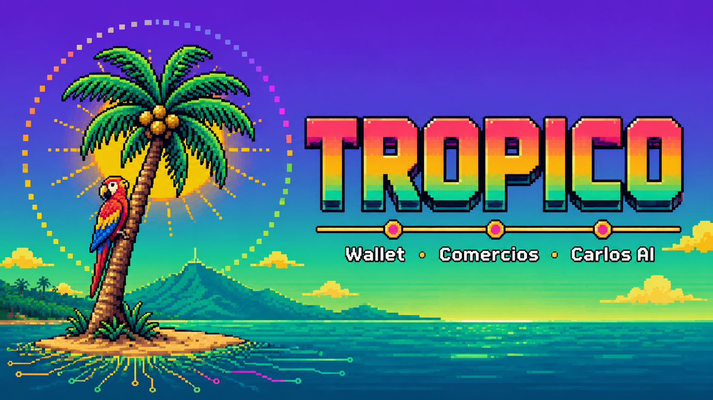

<!-- Banner v2 — pixel art atardecer caribeño: palmera con coco, guacamaya roja-azul-amarilla, sol radiante, mar turquesa, montañas, wordmark TROPICO con gradient sunset (rojo→amarillo→verde→teal) y los 3 pilares: Wallet · Comercios · Carlos AI. Guarda el archivo en docs/images/banner.png para reemplazar el viejo. -->
<p align="center">
  
</p>

# Tropico 🌴

**La wallet caribeña en Solana. USDC + yield + QR para comercios. Hecho en Venezuela.**

> Fintech non-custodial para venezolanos: gestiona dólares digitales, cobra con QR en un segundo, recibe yield automático y deja que tu copiloto AI actúe por ti — sin custodiar tu plata, sin permiso del banco.

[](https://solana.com)
[](#license)
[](https://dev3pack.com)
[](#)

---

## ¿Qué es Tropico?

Tropico es una red económica non-custodial construida sobre Solana para el venezolano que ya usa dólares digitales pero no tiene infraestructura que le responda. No dependes de ningún banco, no entregas tus llaves privadas y puedes verificar cada centavo en Solana Explorer.

El producto tiene dos caras: **Tropico Wallet** para el consumidor (swap, envíos, yield, AI) y **Tropico Comercios** para el merchant (cobros QR con settlement en 1 segundo, fee 1%). Cuando los dos lados están dentro de Tropico, el dinero gira en USDC sin tocar el bolívar ni los bancos.

Encima de eso hay una **capa de integración** — Tropico Pay — que permite a cualquier plataforma externa (delivery, e-commerce, ticketing, SaaS) cobrar en USDC usando el mismo gateway con un solo endpoint REST. Y **Carlos AI** corre sobre [**Lumen**](https://github.com/gabogabucho/lumen-agent), el framework open source de agentes en español — el motor que entiende, decide y conversa. El kit de Tropico es replicable: el mismo `KIT + SKILLS + CAPABILITIES` puede correr también con Hermes (memoria persistente) o OpenClaw (firma delegada on-chain) si otros equipos prefieren ese camino.

Este repo es el MVP del hackathon **dev3pack 2026**, desarrollado desde Venezuela para el Caribe. ☀️

---

## 🚀 Quick start

### Requisitos

- Node.js 20+ (probado en 22.x)
- npm 10+
- Python 3.11+ (solo si vas a correr las capabilities de Lumen)

### Setup

```bash
# 1. Clonar el repo
git clone https://github.com/[tu-usuario]/Hackathon.git tropico
cd tropico

# 2. Instalar dependencias
npm install

# 3. Configurar variables de entorno (todas opcionales — sin ellas corre con mocks)
cp .env.example .env.local 2>/dev/null || touch .env.local
# Editar .env.local con tus keys (ver sección Variables de entorno)

# 4. Levantar dev server
npm run dev
# → http://localhost:3000
```

### Variables de entorno

```bash
# Privy — wallet MPC embedded
NEXT_PUBLIC_PRIVY_APP_ID=

# Helius — RPC de Solana
NEXT_PUBLIC_HELIUS_RPC=https://mainnet.helius-rpc.com/?api-key=YOUR_KEY
HELIUS_API_KEY=

# Carlos AI — Gemini como LLM (o DeepSeek vía LiteLLM)
GOOGLE_GENERATIVE_AI_API_KEY=
# DEEPSEEK_API_KEY=          # alternativa si querés DeepSeek

# Fee accounts (wallet que recibe los fees de Tropico)
NEXT_PUBLIC_TROPICO_FEE_OWNER=
NEXT_PUBLIC_TROPICO_FEE_ATA_USDC=
NEXT_PUBLIC_TROPICO_FEE_ATA_SOL=
NEXT_PUBLIC_TROPICO_FEE_ATA_USDT=

# Cluster
NEXT_PUBLIC_SOLANA_CLUSTER=mainnet-beta
```

Sin ninguna key, la app corre en **modo demo** con mocks honestos y banners explícitos. Ningún flow visual queda roto.

---

## 📂 Estructura del repo

```
.
├── app/                          # Next.js App Router
│   ├── page.tsx                  # Landing pública
│   ├── home/                     # Dashboard del usuario
│   ├── cambiar/                  # Swap con Jupiter v6
│   ├── cobrar/                   # QR Solana Pay para merchants
│   ├── enviar/                   # P2P + claim links por WhatsApp
│   ├── guardar/                  # Yield (mSOL / Kamino)
│   ├── depositar/                # Onramp stub + faucet
│   ├── descubrir/                # Catálogo educativo de tokens
│   ├── comercios/                # Landing del lado merchant
│   ├── integraciones/            # Tropico Pay — 3 patrones de integración
│   ├── carlos/                   # Carlos AI chat
│   │   └── agente/               # Modo Agente — 4 acciones autónomas
│   └── api/
│       ├── checkout/create/      # POST endpoint de Tropico Pay
│       └── carlos/               # Proxy LLM para Carlos
├── components/                   # React UI components
│   ├── Header.tsx                # Sticky, compacta en scroll, drawer mobile
│   ├── VenezuelaBadge.tsx        # Tricolor animado (3 variants: xs/sm/md)
│   ├── DualPrice.tsx             # Precio USD + VES en tiempo real
│   ├── SwapForm.tsx              # Form swap con Jupiter Quote API
│   ├── ReceiveQR.tsx             # QR Solana Pay generado client-side
│   ├── ModuleCard.tsx            # Card de módulo reutilizable
│   ├── AgentActionCard.tsx       # UI de acciones del Modo Agente
│   ├── SplashScreen.tsx          # Animación pixel-art al cargar
│   └── ...                       # TokenCard, PixelLoader, ScrollReveal, etc.
├── lib/                          # Helpers y lógica de negocio
│   ├── checkout.ts               # createCheckoutSession() — Tropico Pay
│   ├── jupiter.ts                # Swap con platformFeeBps=50
│   ├── solana-pay.ts             # buildSolanaPayUrl() + QR
│   ├── carlos-prompt.ts          # System prompt de Carlos
│   ├── agent-actions.ts          # DCA, auto-yield, cashback, rebalance
│   └── mock-data.ts              # Datos mock para modo demo
├── lumen-kit/                    # Tropico Web3 Kit (Lumen)
│   ├── kit/
│   │   ├── personality.yaml      # Personalidad de Carlos
│   │   └── module.yaml           # Declaración del módulo
│   └── skills/                   # 7 skills: prices, balances, swap,
│       │                         #   pay, yield, cashback, agent-actions
│       └── [skill]/SKILL.md      # Definición de cada skill
├── lumen-capabilities/           # Scripts Python ejecutables
│   ├── prices/
│   │   ├── precio_bs.py          # Cotización USD/VES (paralelo + BCV)
│   │   └── precio_usd.py         # Precio de cualquier token en USD
│   └── swap/
│       └── jupiter_quote.py      # Quote real de Jupiter v6
├── docs/
│   ├── TROPICO_BRIEF.md          # Fuente de verdad técnica completa
│   ├── INTEGRATION_API.md        # Spec completo de Tropico Pay
│   ├── LUMEN_INTEGRATION.md      # Doc maestro de Lumen + adapter pseudocode
│   ├── BACKEND_ROADMAP.md        # Roadmap de infraestructura Q3/Q4
│   ├── WALLET_GUIDE.md           # Privy MPC explicado para el usuario
│   ├── ROADMAP.md                # Visión Q3 → Q1 2027
│   ├── DEPLOY.md                 # Guía de deploy a Vercel
│   └── PITCH_DECK.md             # Pitch 6 slides (Marp)
└── scripts/
    └── screenshots.mjs           # Playwright — regenera los 17 screenshots
```

---

## Los 5 módulos del consumidor

| Módulo | URL | Qué hace |
|---|---|---|
| **Wallet / Home** | `/home` | Dashboard: saldo USDC, yield acumulado, accesos rápidos a los 6 módulos |
| **Cambiar** | `/cambiar` | Swap con cotización real de Jupiter Quote API + fee 0.5% (`platformFeeBps=50`) |
| **Cobrar** | `/cobrar` | QR Solana Pay generado client-side — cualquier wallet puede pagar |
| **Enviar** | `/enviar` | P2P a wallet address o claim link para quien no tiene wallet, compartible por WhatsApp |
| **Guardar** | `/guardar` | Yield ~5% APY default ON — mSOL o Kamino bajo el hood |
| **Carlos AI by Lumen** | `/carlos` | Copiloto venezolano — 7 capacidades reales (saldos, precios, swap, QR, yield, cashback, agente) powered by [Lumen](https://github.com/gabogabucho/lumen-agent) |

### Modo Agente — `/carlos/agente`

Carlos puede actuar on-chain con tu permiso explícito. Cuatro acciones hoy (mock en MVP, real en Q3 con OpenClaw):

- **DCA** — compra periódica de USDC/SOL a intervalos definidos por el usuario
- **Auto-yield** — mueve el excedente de saldo a la mejor estrategia de yield disponible
- **Auto-cashback** — aplica cashback automático en cobros Solana Pay
- **Rebalance** — mantiene la proporción SOL/USDC/mSOL definida por el usuario

---

## Tropico Comercios + Tropico Pay 🌊

### Lado merchant (`/comercios`)

Cualquier comercio puede afiliarse sin hardware ni contrato:

- Cobra con QR Solana Pay — settlement **< 1 segundo**
- Fee **1%** por transacción (pagado por el cliente, el merchant recibe su monto exacto)
- Dashboard de ventas del día en USDC
- Logo "Acepta Tropico" descargable para la vidriera

### Tropico Pay — capa de integración (`/integraciones`)

Tropico Pay es el gateway que permite a plataformas externas cobrar en USDC sobre Solana. Tres patrones:

| Patrón | Cuándo usarlo |
|---|---|
| **Solana Pay link** | QR físico, links por WhatsApp, ticketing, integraciones rápidas |
| **REST + webhook** | E-commerce, marketplaces, cualquier backend que necesite confirmación on-chain |
| **Drop-in button** | Apps móviles o web que quieren embeber el checkout sin tocar el flow de pago |

**Endpoint REST:**

```bash
POST /api/checkout/create
Content-Type: application/json

{
  "merchantWallet": "Mer7GhjMAcEYTmpAcePtAgVgkLogo3ZgKHSPaC9Th",
  "amount": 12.50,
  "tokenSymbol": "USDC",
  "partnerId": "yummy-rides",
  "orderId": "ORD-9182",
  "channel": "delivery",
  "webhookUrl": "https://api.tupplataforma.com/webhook/tropico"
}
```

```json
{
  "sessionId": "tps_a3f8b2c1d4e5...",
  "reference": "a3f8b2c1d4e5f6a7b8c9...",
  "solanaPayUrl": "solana:Mer7Ghj...?amount=12.5625&spl-token=EPjFW...",
  "hostedCheckoutUrl": "https://tropico.app/checkout?session=tps_...",
  "customerPays": 12.56,
  "merchantReceives": 12.50,
  "feeBps": 50,
  "expiresAt": "2026-05-08T15:30:00Z"
}
```

Los webhooks van firmados con **HMAC-SHA256**. Ver spec completo en [`docs/INTEGRATION_API.md`](docs/INTEGRATION_API.md).

**4 verticales soportadas:** delivery (estilo apps de comida), e-commerce (marketplaces), ticketing (QR único por evento), SaaS/suscripciones (recurrente vía Modo Agente).

**3 surfaces de integración listas:**

| Surface | Path | Para qué |
|---|---|---|
| **REST API** | `app/api/checkout/create/route.ts` | Server-to-server con auth Bearer + CORS abierto. Devuelve la sesión + URL Solana Pay. |
| **Hosted checkout** | `app/checkout/page.tsx` (`/checkout?session=…`) | Página white-label con QR + deeplink wallet. El partner redirige al usuario aquí. |
| **Drop-in SDK** | `public/sdk/tropico-pay.js` | `<script>` + `<button data-tropico-pay …>`. Auto-monta modal con QR + polling. Cero estado en el partner. |

**Modelo de fee — HACIA ARRIBA**: el merchant siempre recibe el precio que pidió. El cliente absorbe el fee (0.5% en Tropico Pay, 1% en Cobrar merchant-facing). `customerPays = amount × (1 + feeBps/10000)`, `merchantReceives = amount` exacto.

---

## Carlos AI corre sobre Lumen 🌟

**Carlos AI by Lumen.** Tropico eligió [Lumen](https://github.com/gabogabucho/lumen-agent) — framework open source MIT de agentes en español por @gabogabucho — como motor de Carlos. Es lo que entiende, decide y conversa.

### Por qué Lumen

- **Open source MIT** — auditable, sin vendor lock-in
- **Pensado en español** — no es wrapper de framework gringo
- **Arquitectura modular** — 3 capas declarativas (KIT + SKILLS + CAPABILITIES) sin acoplamiento
- **Tool calling nativo** — LLM puede invocar scripts Python reales (precios, swaps, balances)
- **Hot reload** — cambias un skill sin restart

### Cómo funciona el Tropico Web3 Kit (3 capas)

```
KIT (lumen-kit/kit/)
  ├── module.yaml         → metadatos del módulo
  └── personality.yaml    → identidad + tono + reglas + knowledge
        │
        ▼
SKILLS (lumen-kit/skills/)
  ├── tropico-balances/SKILL.md     → "consultar saldos"
  ├── tropico-prices/SKILL.md       → "cotizar USD/Bs y tokens"
  ├── tropico-swap/SKILL.md         → "hacer swaps via Jupiter"
  ├── tropico-pay/SKILL.md          → "generar QRs Solana Pay"
  ├── tropico-yield/SKILL.md        → "estrategias de yield"
  ├── tropico-cashback/SKILL.md     → "consultar cashback acumulado"
  └── tropico-agent-actions/SKILL.md → "DCA, auto-yield, rebalance"
        │
        ▼
CAPABILITIES (lumen-capabilities/)
  ├── balances/wallet_balances.py  ← Helius RPC
  ├── prices/{precio_bs,precio_usd}.py ← DolarAPI + Jupiter Price
  ├── swap/jupiter_quote.py        ← Jupiter v6 Lite API
  ├── pay/solana_pay_url.py        ← Solana Pay spec
  ├── yield/yield_estimate.py      ← mSOL/Kamino mock
  ├── cashback/cashback_summary.py ← store.json
  └── agent/agent_execute.py       ← OpenClaw stub
```

### El kit es replicable — Hermes y OpenClaw también pueden correrlo

Decisión clave: el kit (markdown + YAML + Python) **no tiene dependencias propietarias de Lumen**. Otro equipo que prefiera otro orquestador puede portar el mismo kit con un adapter de ~30 líneas:

| Si prefieres... | Para qué sirve | Adapter |
|---|---|---|
| **Lumen** (lo que usa Tropico) | Orquestador completo + tool calling + personality | nativo |
| **Hermes** ([Nous Research](https://github.com/NousResearch/Hermes-Function-Calling)) | Memoria persistente + razonamiento sobre cuándo proponer | ~30 líneas, ver `docs/LUMEN_INTEGRATION.md` §13 |
| **OpenClaw** | Firma delegada on-chain con session keys + policy engine | ~30 líneas, mismo doc |

**No es combinación obligatoria.** Tropico en MVP corre **sólo sobre Lumen**. Hermes y OpenClaw quedan como upgrade opcional Q3 2026 si queremos memoria persistente y firma autónoma con policies. Otros equipos pueden saltarse Lumen y arrancar directo con Hermes/OpenClaw — el kit funciona igual.

Doc completa de Carlos: [`docs/CARLOS_AI.md`](docs/CARLOS_AI.md). Replicabilidad: [`docs/LUMEN_INTEGRATION.md`](docs/LUMEN_INTEGRATION.md) §13.

---

## Non-custodial de verdad 🔐

Tropico usa **Privy embedded wallet** con **MPC (Multi-Party Computation)**:

```
Usuario hace login con email → OTP
Privy ejecuta MPC handshake en el browser:
  ├── share-1 → dispositivo del usuario (encriptado)
  ├── share-2 → infraestructura Privy (encriptada)
  └── share-3 → guardian backup (encriptado)

La llave privada completa NUNCA existe en ningún servidor.
Para firmar una tx, los 3 shares cooperan sin reconstruirla.
```

Lo que no necesitas: seed phrase, extensión de browser, app nativa, recordar palabras.

Lo que sí tienes: login con email en 15 segundos, biométrica opcional (TouchID/FaceID), recuperación cross-device, export de seed phrase si querés moverte a otra wallet sin pedir permiso.

**¿Es non-custodial de verdad?** Sí, técnicamente. Privy no puede firmar nada sin el share del dispositivo del usuario. La transparencia es verificable: cada transacción aparece en Solscan con tu pubkey.

> Cuidado con los "casi" non-custodial — si no puedes mover tu plata a otra wallet sin pedir permiso, no eres el dueño. En Tropico puedes exportar tu seed phrase desde configuración en cualquier momento.

---

## Identidad visual

**Paleta caribeña venezolana** (Solana como acento, no como base):

| Color | Hex | Uso |
|---|---|---|
| Sun (amarillo caribeño) | `#FFD166` | Acentos cálidos, sol, badges |
| Coral (hot pink) | `#EF476F` | Acción, atardecer, plumaje guacamaya |
| Sea (verde tropical) | `#06D6A0` | Mar, confirmaciones, frondas |
| Sand beige | `#d4b896` | Fondos cálidos, playa |
| Solana Purple | `#9945FF` | Acento tech (no dominante) |
| Ink (fondo base) | `#0a0a14` | Background con gradient warm overlay |

**Tipografía**: Honk (wordmark), Bricolage Grotesque (titulares), Manrope (body/UI).

**Header v2**: sticky, compacta en scroll (logo 40px → 24px), drawer hamburger en mobile, active link highlight. `components/Header.tsx`.

**VenezuelaBadge**: tricolor animado con `conic-gradient` + `@property --vz-angle`, texto "Hecho en Venezuela · Para el Caribe". 3 variants: `xs / sm / md`. `components/VenezuelaBadge.tsx`.

---

## Rutas para explorar

| URL | Qué muestra |
|---|---|
| `/` | Landing pública — hero + "Para cualquier venezolano" + cards módulos |
| `/home` | Dashboard: saldo USDC + yield + 6 ModuleCards + balances |
| `/cambiar` | Swap con cotización **Jupiter Quote API real** |
| `/cobrar` | QR Solana Pay generado real + listener simulado |
| `/enviar` | Form send + claim link + WhatsApp deep link funcional |
| `/guardar` | Yield UI con 3 estrategias (mSOL, Kamino USDC, Kamino LP) |
| `/depositar` | Onramp stub honesto + faucet button |
| `/descubrir` | Catálogo educativo de 8 tokens en venezolano |
| `/comercios` | Landing del lado merchant con comparativa vs POS tradicional |
| `/integraciones` | Tropico Pay — 3 patrones de integración + verticales |
| `/carlos` | Carlos AI by Lumen — chat + 7 capacidades + input funcional |
| `/carlos/agente` | Modo Agente — 4 acciones autónomas (DCA, auto-yield, auto-cashback, rebalance) powered by Lumen |

---

## Stack técnico

### Frontend
- **Framework**: Next.js 15 (App Router) + React 19 + Tailwind 3
- **Animaciones**: CSS keyframes + variable fonts + `@property` CSS (sin librerías pesadas)
- **Iconos**: Lucide React — open-source, tree-shakeable

### Wallet y blockchain
- **Wallet primario**: [Privy](https://privy.io) embedded MPC (login con email)
- **Wallet fallback**: Solana Wallet Adapter (Phantom, Solflare)
- **Swap**: [Jupiter v6](https://lite-api.jup.ag) con `platformFeeBps=50`
- **Pay**: [Solana Pay spec](https://docs.solanapay.com) + QR client-side (`qrcode`)
- **RPC**: [Helius](https://helius.dev)

### Datos en vivo
- **Tasa USD/VES**: [ve.dolarapi.com](https://ve.dolarapi.com) (paralelo + BCV oficial)
- **Precios tokens**: Jupiter Price API v3
- **State**: TanStack Query 5

### Principios no negociables
1. **Cero programa Anchor custom** — solo protocolos abiertos (SPL Token, Jupiter, Solana Pay)
2. **Cero backend persistente** — solo Edge routes `/api/*`
3. **Non-custodial estricto** — Tropico nunca accede a llaves privadas
4. **API keys secretas solo server-side** — nunca en client
5. **Mobile-first PWA** — funciona en Android viejo, instalable sin app store
6. **Cero política venezolana** en Carlos AI
7. **Cero promesas de rendimientos garantizados**

---

## Modelo de negocio

| Stream | Tasa | Mecánica |
|---|---|---|
| **Swap** | 0.5% | Jupiter `platformFeeBps=50` al ATA propio |
| **Send** | 0.3% | Spread USDC en envíos |
| **Yield** | 2% del yield | Performance fee sobre mSOL/Kamino |
| **Merchant fee** | 1% | Por cada cobro QR (cargo al cliente) |
| **Tropico Pay** | 0.5% | Por cada checkout de plataforma externa |

---

## Roadmap Q3/Q4

- **Q3 2026**: Privy + Helius conectados en prod, Lumen real (no mock), OpenClaw + delegated session keys, Hermes memoria, on-ramp con partners P2P
- **Q3 2026**: Tropico Pay en producción — primeros merchants integrados (delivery, ticketing)
- **Q4 2026**: Tropico Card (debit Visa backed por USDC + cashback), Tropico Vaults (Kamino), bug bounty público
- **Q1 2027**: Expansión LATAM (Colombia, Argentina, México, Perú, Chile), Solana Mobile app nativa

---

## 📚 Docs

| Documento | Qué contiene |
|---|---|
| [`docs/TROPICO_BRIEF.md`](docs/TROPICO_BRIEF.md) | Fuente de verdad técnica completa del proyecto |
| [`docs/INTEGRATION_API.md`](docs/INTEGRATION_API.md) | Spec completo de Tropico Pay: endpoints, webhooks HMAC, ejemplos |
| [`docs/LUMEN_INTEGRATION.md`](docs/LUMEN_INTEGRATION.md) | Doc maestro de Lumen + adapter pseudocode para Hermes/OpenClaw |
| [`docs/WALLET_GUIDE.md`](docs/WALLET_GUIDE.md) | Privy MPC explicado paso a paso para el usuario final |
| [`docs/ROADMAP.md`](docs/ROADMAP.md) | Visión detallada Q3 2026 → Q1 2027 |
| [`docs/DEPLOY.md`](docs/DEPLOY.md) | Guía de deploy a Vercel |
| [`docs/PITCH_DECK.md`](docs/PITCH_DECK.md) | Pitch deck 6 slides (Marp) |

---

## 🤝 Contribuir

MVP del hackathon dev3pack 2026. Post-hackathon:

- Issues en GitHub para bugs y features
- Programa de afiliación de comercios
- Bug bounty público (Q3 2026)
- Más estrategias de yield (Jito Restaking, Sanctum)

---

## 📜 License

MIT — ver [`LICENSE`](LICENSE).

---

## 👤 Autor

Construido por un venezolano para venezolanos. 🇻🇪

- **Email**: rafa.oviedo2000@gmail.com
- **Hackathon**: [dev3pack 2026](https://dev3pack.com), Caracas hub

---

> **Tropico no es una wallet. Es la infraestructura económica que el venezolano necesita y que nadie le está dando — hasta hoy.** 🌴
