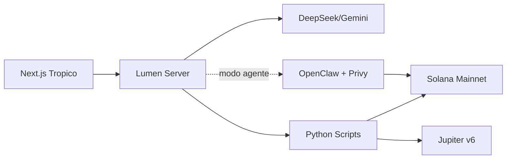

# Tropico — Inventario de assets visuales

> Lista completa de imágenes que necesita el repo para presentar el proyecto profesionalmente. Cada asset tiene: dónde va, qué tamaño, cómo generarlo, y si es bloqueante o nice-to-have.

**Última actualización**: 2026-05-08

---

## 🔴 BLOQUEANTES — sin estos el repo se ve incompleto

### 1. Logo principal `public/icons/tropico-512.png`

**Tamaño**: 512×512 PNG con transparencia (o fondo `#0a0a14`)
**Dónde se usa**:
- Header de todas las páginas (reemplaza el placeholder gradient actual en `app/page.tsx` línea ~71, etc.)
- Pitch deck (slide 1)
- Open Graph (cuando lo compartas en redes)

**Cómo generarlo**: usa el prompt completo en `docs/LOGO_PROMPT.md` con Midjourney/DALL-E/Flux. Tip: genera 4 variantes y elige.

### 2. Iconos PWA `public/icons/icon-192.png` y `public/icons/icon-512.png`

**Tamaños**: 192×192 PNG y 512×512 PNG (cuadrados, fondo opaco)
**Dónde se usan**:
- `public/manifest.json` ya los referencia (línea 14-22)
- Cuando el usuario instala la PWA con "Add to Home Screen", Android usa estos iconos

**Cómo generarlos**: una vez tengas `tropico-512.png`, escalá con cualquier tool:
```bash
# Si tienes ImageMagick instalado:
brew install imagemagick
convert public/icons/tropico-512.png -resize 192x192 public/icons/icon-192.png
cp public/icons/tropico-512.png public/icons/icon-512.png
```

O usa un servicio web tipo https://realfavicongenerator.net (subís 1 PNG, te devuelve todos los tamaños).

### 3. Favicon `public/favicon.ico`

**Tamaño**: 32×32 (multi-resolución ICO con 16, 32, 48)
**Dónde se usa**: pestaña del browser, bookmarks
**Cómo generarlo**: mismo flow del 192 — `realfavicongenerator.net` te lo arma de un click.

---

## 🟡 ALTAMENTE RECOMENDADOS — hacen al repo "vendedor"

### 4. README hero banner `docs/images/banner.png`

**Tamaño**: 1200×400 PNG
**Dónde va**: arriba de todo en `README.md`, antes del título
**Qué muestra**: el logo + tagline "La red económica del venezolano en Solana" sobre el fondo gradient purple→green

**Cómo generarlo**:
- Diseñalo en Canva (template "Banner")
- O usa [shields.io](https://shields.io) para algo simple
- O renderizá el primer slide del pitch deck como PNG:
  ```bash
  npx @marp-team/marp-cli@latest docs/PITCH_DECK.md --images png --output-dir docs/slides/
  cp docs/slides/PITCH_DECK.001.png docs/images/banner.png
  ```

Luego agrega al README arriba del título:
```markdown

```

### 5. Screenshots de las 11 pantallas `docs/images/screens/`

**Tamaño**: 1440×900 PNG (desktop) o 390×844 (mobile)
**Dónde van**: README + form del hackathon (suelen pedir 3-5 screenshots)

**Lista mínima (5 screens prioritarias)**:
- `landing.png` — `/` (la entrada del producto)
- `home.png` — `/home` (el dashboard, vende la propuesta)
- `cobrar.png` — `/cobrar` con el QR generado (el momento red económica)
- `agente.png` — `/carlos/agente` (el wow técnico)
- `comercios.png` — `/comercios` con la comparativa Banesco

**Cómo capturarlos**:
1. Abre cada URL en Chrome
2. Dev tools → Toggle device toolbar (Cmd+Shift+M) → "Responsive" 1440×900
3. Screenshot full-page: clic 3 puntos del dev tools → "Capture full size screenshot"
4. Guarda en `docs/images/screens/`

O automatizá con Playwright:
```bash
npm install -D playwright
npx playwright install chromium
# Ver script en sección 11 de este doc
```

### 6. Demo GIF `docs/images/demo.gif`

**Tamaño**: 800×500, ~5MB max, ~10-15 segundos
**Dónde va**: README — sección "🎬 Demo" después del título principal
**Qué muestra**: flow rápido de Landing → Home → Cobrar (con QR) → momento red económica

**Cómo generarlo**:
- macOS: usa [Kap](https://getkap.co/) (free) o [CleanShot X](https://cleanshot.com)
- Grabá la pantalla con QuickTime, después convertí a GIF con [ezgif.com](https://ezgif.com/video-to-gif)
- O FFmpeg local:
  ```bash
  ffmpeg -i demo.mov -vf "fps=15,scale=800:-1" -loop 0 docs/images/demo.gif
  ```

### 7. Open Graph image `public/og-image.png`

**Tamaño**: 1200×630 PNG (estándar Twitter Cards / Facebook OG)
**Dónde va**: cuando alguien pega tu URL en Twitter/Telegram/WhatsApp, esta es la imagen que aparece
**Qué muestra**: logo + tagline + URL pequeña abajo

**Cómo configurarlo**: agregar en `app/layout.tsx`:

```tsx
export const metadata: Metadata = {
  title: "Tropico — La red económica del venezolano en Solana",
  description: "Ahorra ganando, paga sin perder. Non-custodial, en español venezolano.",
  openGraph: {
    title: "Tropico — La red económica del venezolano en Solana",
    description: "La wallet caribeña en Solana. Non-custodial. USDC + yield + QR para comercios. Hecho en Venezuela.",
    images: ["/og-image.png"],
    type: "website",
  },
  twitter: {
    card: "summary_large_image",
    title: "Tropico",
    description: "La red económica del venezolano en Solana.",
    images: ["/og-image.png"],
  },
};
```

---

## 🟢 NICE TO HAVE — pulir si te queda tiempo

### 8. Comparativa Banesco vs Tropico `docs/images/comparativa.png`

**Tamaño**: 1200×800 PNG
**Dónde va**: README + slide 2 del pitch + tweet del lanzamiento
**Qué muestra**: la tabla "Por cada $1k vendidos, te ahorrás $35" en infografía visual

### 9. Diagrama de arquitectura `docs/images/arquitectura.png`

**Tamaño**: 1600×900 PNG
**Dónde va**: README sección "Stack técnico" + LUMEN_INTEGRATION.md
**Qué muestra**: el diagrama ASCII actual del brief, pero como infografía

**Cómo generarlo**: Excalidraw (https://excalidraw.com), Figma, o Mermaid:


### 10. Mockups mobile `docs/images/mobile-screens.png`

**Tamaño**: 1200×900 PNG con 3 mockups iPhone lado a lado
**Dónde va**: pitch deck slide 4 (demo)
**Qué muestra**: 3 pantallas key (home + cobrar + agente) en frames de iPhone

**Cómo generarlo**:
- [Mockuuups Studio](https://mockuuups.studio/) (free tier)
- [Cleanmock](https://cleanmock.com)
- O Figma con plugin "Mockup Maker"

---

## 11. Script para capturar screenshots automático (Playwright)

Si tienes tiempo y quieres automatizar las 11 capturas:

```bash
# 1. Instalar
npm install -D playwright
npx playwright install chromium

# 2. Crear script: scripts/screenshots.mjs
mkdir -p scripts docs/images/screens
cat > scripts/screenshots.mjs << 'EOF'
import { chromium } from "playwright";

const ROUTES = [
  ["/", "landing"],
  ["/home", "home"],
  ["/descubrir", "descubrir"],
  ["/cambiar", "cambiar"],
  ["/cobrar", "cobrar"],
  ["/enviar", "enviar"],
  ["/guardar", "guardar"],
  ["/depositar", "depositar"],
  ["/comercios", "comercios"],
  ["/carlos", "carlos"],
  ["/carlos/agente", "agente"],
];

const browser = await chromium.launch();

// Desktop
const desktop = await browser.newContext({ viewport: { width: 1440, height: 900 } });
for (const [url, name] of ROUTES) {
  const page = await desktop.newPage();
  await page.goto(`http://localhost:3000${url}`, { waitUntil: "networkidle" });
  await page.screenshot({ path: `docs/images/screens/${name}-desktop.png`, fullPage: true });
  await page.close();
  console.log(`✅ ${name}-desktop.png`);
}

// Mobile
const mobile = await browser.newContext({
  viewport: { width: 390, height: 844 },
  deviceScaleFactor: 2,
  isMobile: true,
});
for (const [url, name] of ROUTES) {
  const page = await mobile.newPage();
  await page.goto(`http://localhost:3000${url}`, { waitUntil: "networkidle" });
  await page.screenshot({ path: `docs/images/screens/${name}-mobile.png`, fullPage: true });
  await page.close();
  console.log(`✅ ${name}-mobile.png`);
}

await browser.close();
EOF

# 3. Ejecutar (con dev server corriendo en otra terminal)
node scripts/screenshots.mjs
```

Resultado: 22 screenshots (11 desktop + 11 mobile) en `docs/images/screens/` listos para README + pitch.

---

## 📋 Checklist final de assets antes del submit

### Mínimo viable para hackathon

- [ ] `LICENSE` (MIT) — ✅ YA EXISTE
- [ ] `README.md` con tagline + demo URL + screenshots — ✅ EXISTE (falta agregar URL real + screenshots)
- [ ] `public/icons/tropico-512.png` — logo principal
- [ ] `public/icons/icon-192.png` y `icon-512.png` — PWA icons
- [ ] `public/favicon.ico`
- [ ] 5 screenshots en `docs/images/screens/` (landing, home, cobrar, agente, comercios)
- [ ] `docs/images/demo.gif` (10-15s del flow)

### Para que el repo se vea premium

- [ ] `docs/images/banner.png` (hero del README)
- [ ] `public/og-image.png` + metadata `openGraph` en `app/layout.tsx`
- [ ] `docs/images/comparativa.png` (Banesco vs Tropico)
- [ ] `docs/images/arquitectura.png` (Lumen + OpenClaw + Solana)

### Para destacar de la competencia

- [ ] `docs/images/mobile-screens.png` (3 iPhones lado a lado)
- [ ] Demo video (MP4 1080p) en YouTube unlisted
- [ ] Logo SVG (vectorial) en `public/icons/tropico.svg` para escalabilidad infinita

---

## 🎨 Tip para que TODOS los assets se sientan parte de la misma marca

Pasale a cualquier herramienta de diseño este "brand kit" extraído:

```
Marca: Tropico
Tagline: La red económica del venezolano en Solana
Idioma: Español venezolano (no rioplatense)

Paleta primaria:
  - Background: #0a0a14
  - Solana Purple: #9945FF
  - Solana Green: #14F195

Paleta caribeña (acentos):
  - Sun: #FFD166
  - Coral: #EF476F
  - Sea: #06D6A0

Tipografía:
  - Display: Bricolage Grotesque (Bold, tracking tight)
  - Body: Inter

Estilo:
  - Pixel art para logo
  - Mobile-first PWA
  - Dark theme
  - Caribeño cálido + cripto-fintech moderno
```

Cualquier diseñador o herramienta IA con esto puede generar assets coherentes.

---

**Próximo paso**: generar el logo (30min) y después usar Playwright para los screenshots (10min). En 1 hora tienes todos los assets bloqueantes listos.
